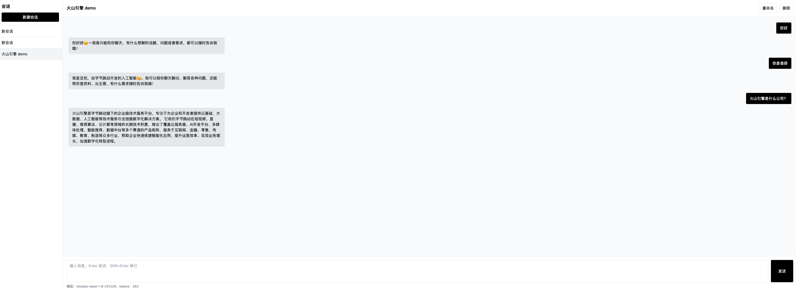

# 火山引擎 - 火山方舟豆包大模型调用示例

> 本项目完全基于 Trae 进行 Vibe Coding 构建。

本项目基于火山引擎的 **火山方舟 (Volcengine Ark)** 平台，通过集成 **Python SDK** 来调用 **Doubao (豆包)** 大模型。

为了直观展示模型调用能力，项目中包含了一个简易的前端演示界面。该界面实现了与豆包大模型的多轮对话功能，帮助开发者快速理解如何通过 SDK 接入并使用火山方舟的 AI 能力。

> **📚 相关文档**
>
> - [火山方舟 (Volcengine Ark) 产品主页](https://www.volcengine.com/product/ark)
> - [火山方舟 API 文档](https://www.volcengine.com/docs/82379/1099475)
> - [豆包大模型介绍](https://www.volcengine.com/product/doubao)



## ✨ 功能特性

- **多轮对话**：支持与 Ark 大模型（如 Doubao-pro/lite）进行上下文连贯的对话。
- **会话管理**：
  - 左侧侧栏管理历史会话。
  - 支持新建、切换、重命名和删除会话。
  - 会话数据保存在本地浏览器（LocalStorage），隐私安全。
- **界面友好**：
  - 仿豆包风格的 UI 设计。
  - 响应式布局，适配桌面与移动端。
  - 实时显示 Token 消耗情况。
- **易于扩展**：后端使用 FastAPI，结构清晰，方便二次开发。

## 🛠️ 技术栈

- **后端**：Python, FastAPI, Uvicorn, Volcengine Python SDK
- **前端**：HTML5, Tailwind CSS (CDN), Vanilla JavaScript

## 🚀 快速开始

### 1. 克隆项目

```bash
git clone https://github.com/YuhaoYeSteve/volcengine-examples.git
cd volcengine-examples
```

### 2. 安装依赖

确保你安装了 Python 3.9+。

```bash
pip install -r requirements.txt
```

### 3. 配置 API Key

你需要一个火山引擎的 API Key。

1. 复制配置文件模板：
   ```bash
   cp config.example.ini config.ini
   ```
2. 编辑 `config.ini`，填入你的 API Key：
   ```ini
   [ARK]
   api_key = 你的_API_KEY
   ```
   *或者，你也可以通过环境变量设置：*
   ```bash
   export ARK_API_KEY=你的_API_KEY
   ```

### 4. 启动服务

```bash
python -m uvicorn ark_server:app --host 0.0.0.0 --port 8000
```

### 5. 访问应用

打开浏览器访问：[http://localhost:8000](http://localhost:8000)

## 📂 项目结构

```
.
├── ark_server.py      # 主后端服务 (FastAPI)
├── chat.html          # 主前端页面
├── config.ini         # 配置文件 (需自行创建)
├── config.example.ini # 配置文件模板
├── requirements.txt   # 项目依赖
└── assets/            # 静态资源 (图片等)
```

## 📝 备注

- 本项目仅供学习和演示使用。
- 前端使用 CDN 加载 Tailwind CSS，请确保网络通畅。
- 默认使用的模型接入点为 `doubao-seed-1-8-251228`，如需更改请修改 `ark_server.py` 中的 `model` 参数。

## 📅 更新日志

- **v1.1.0** (2026-02-04)
  - ✨ 新增：流式输出（打字机效果），提升对话体验。
  - 🔒 优化：在 AI 回复生成过程中禁用输入框和发送按钮，防止重复提交。

- **v1.0.0** (2026-02-04)
  - 🎉 初始发布：基于 Volcengine Ark SDK 的豆包大模型对话演示。
  - 💬 功能：支持基本的多轮对话、会话管理。
